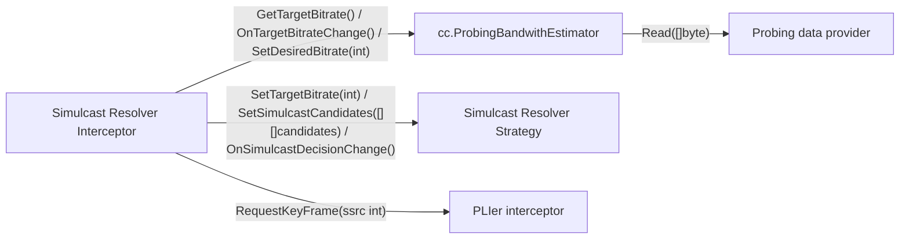
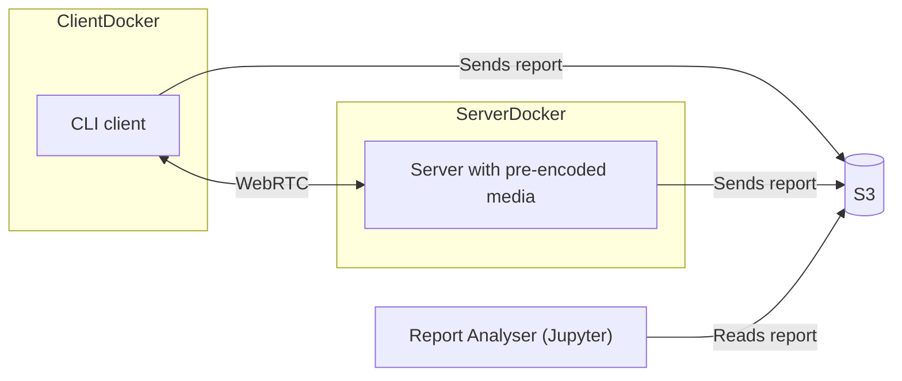

## VIBE: VIdeoBitrateEstimator for pion

We aim at creating pluggable set of interceptors that work with [pion](https://github.com/pion/webrtc) for accurate 
bandwith estimation and simulcast resolving in dynamic network conditions.

### High-level interceptor scheme

#### Simulcast Resolver Interceptor

Outgoing media interceptor that disables all simulcast layers except for one, chosen by injected strategy.

#### cc.ProbingBandwithEstimator

Outgoing media interceptor interface that is enriched with `SetDesiredBitrate(int)` method for more sensible probing. First implementation may use gcc with prober.

#### Probing data provider

Excessive probing data provider (may be retransmitted packets / FEC packets).

#### Simulcast resolver strategy

Strategy to define which layers are shown based on their estimated bitrate and current target bitrate (custom implementation may add priorities, etc).

#### PLIer interceptor

Incoming media interceptor that sends PLI requests with debunce until key-frame is received on demand. Information about it being a keyframe is added to packet interceptor.Attributes.

Also, it may include outgoing media interceptor to forward PLI from incoming RTCP, but this is not in MVP.

### Testing stand

Testing stand consists of client/server pair, both implemented in pion. We use S3 as a persistent storage of reports,
so that it is easy to view any report without copying it from docker container or remote machine.

Also, we provide js implementation for demonstration/verification purposes.

### TODOs

- [x] Establish WebRTC connection between CLI client and testing server

- [ ] Implement cc.ProbingBandwithEstimator with baseline: gcc+prober

- [ ] Implement PLIer interceptor

- [ ] Implement Simulcast Resolver Interceptor + strategy

- [ ] Collect statistic reports locally

- [ ] Create jupyter notebook to explore reports / calculate BWE score how well did it worked

- [ ] Upload statistic reports to s3 automatically

- [ ] Run testing stand inside Docker + linux tc. Automate scenarios

- [ ] Try FEC probing (?)

- [ ] Beat the baseling solution
